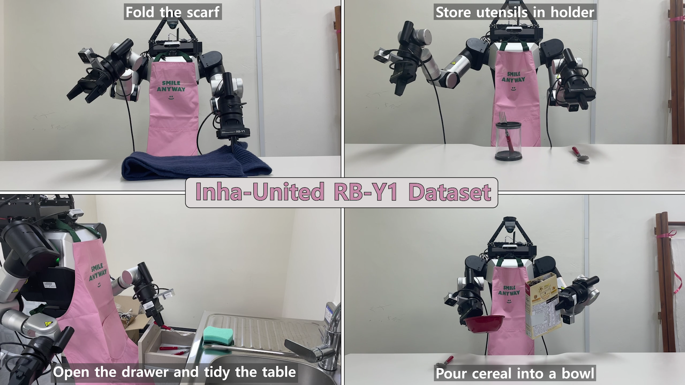

<div align="center">
  <br/>
  <h1>📁 inha-rby1-dataset</h1>
  <span><b>Inha-United real-world RB-Y1 humanoid demonstration dataset for diverse manipulation tasks.</span><br/><br/>
  <a href="https://inha-united.github.io/Home2026/">
    
  </a>
  <a href="https://www.youtube.com/@Inha-United_Home">
    
  </a>
  <a href="https://inha-united-athome.github.io/inha-rby1-dataset/">
    
  </a>
  <a href="https://huggingface.co/inha-united-athome">
    
  </a>
</div>

<p align="center">
  
</p>

## Dataset Overview
The **INHA-RBY1 Dataset** is a real-world humanoid manipulation dataset collected with the Rainbow Robotics RB-Y1 platform, covering a diverse set of manipulation tasks.

<table align="center" width="90%">
  <tr>
    <td align="center">
      
    </td>
    <td align="center">
      
    </td>
  </tr>
  <tr>
    <td align="center">
      
    </td>
    <td align="center">
      
    </td>
  </tr>
</table>

## File Structure
```
    rby1-datasets
        └── rby1_YYYYMMDD_HHMMS/
            ├── data/               # Parquet data
            ├── videos/             # Video files
            ├── frames/             # Cached keyframes
            ├── annotations/        # Human-labeled data
            └── meta/               # Metadata   
```

## Documentation
For more details on the data collection process, dataset structure, download links, and usage examples, please visit our documentation page.

<p align="center">
  <a href="https://inha-united-athome.github.io/inha-rby1-dataset/">
    <strong style="font-size: 1.6em;">👉 INHA-RBY1-Dataset Documentation Page</strong>
  </a>
</p>

## License
Copyright &copy; 2026 Inha-United